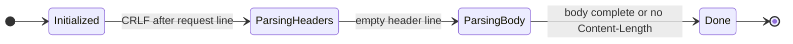
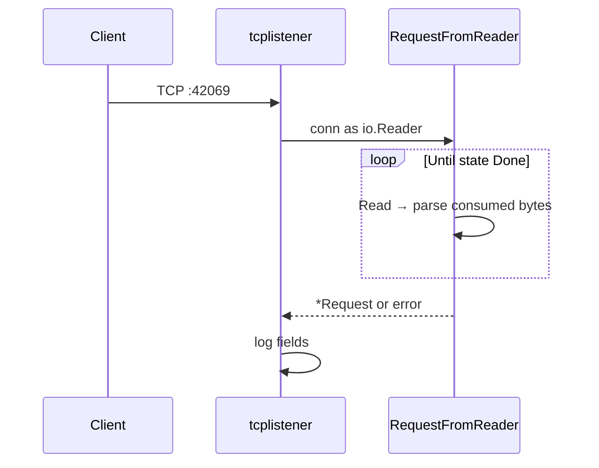

# http-from-tcp

### Incremental HTTP/1.1 request parsing on raw TCP

---

## Overview

Go implementation of **HTTP/1.1 request parsing** on `net.Conn`, without `net/http`. Incoming data is a TCP byte stream; an explicit state machine produces a structured request (request line, headers, `Content-Length` body) while handling arbitrary `Read()` chunk sizes.

Scope is deliberate: **wire-level HTTP/1.1 request handling**—not a web framework, not HTTP/2/TLS, not full RFC compliance. Server concerns (responses, routing, connection policy) are layered on top of the parser as separate packages.

| Status | Capability |
|--------|------------|
| **Shipped** | Request line, headers, `Content-Length` body; incremental buffer; chunk-sized tests |
| **In progress** | HTTP responses, routing, per-connection timeouts, resource limits |
| **Planned** | Concurrent accept loop, keep-alive, graceful shutdown, integration tests & benchmarks |

### What this codebase is built to show

- **Incremental stream parsing** — consume a prefix, return bytes parsed, resume when more data arrives; no assumption that a full message fits in one read.
- **TCP vs HTTP boundaries** — `internal/request` and `internal/headers` have no `net` imports; framing logic stays separate from socket policy.
- **Protocol-aware structure** — request line, header block, and body phases match HTTP/1.1 message layout, with validation at each step.
- **Defensive parser design** — reject invalid methods, versions, header syntax, and body length mismatches; tests drive malformed and split-input cases.
- **Systems-level layering** — parser correctness first; connection deadlines, caps, and shutdown belong in a dedicated server layer (planned).

---

## Motivation

`net/http` and routers handle accept loops, framing, limits, and error responses by default. That is appropriate for production services. It also makes it easy to skip questions that matter when debugging or hardening a server:

- Where does a message end on a long-lived connection?
- What happens when a client sends one byte every few seconds?
- Which failures should surface as `400` vs connection close?

This repo keeps those concerns visible: **TCP supplies octets; HTTP defines message structure.** The current code implements the parse path; the roadmap adds the operational envelope around it.

---

## Features

### Request parsing (implemented)

- **HTTP/1.1 request line** — method (`A–Z`), request-target, `HTTP/1.1` only
- **Header block** — `\r\n`-delimited lines, case-insensitive keys, duplicate merging, key validation
- **Body** — `Content-Length` with over/under-length checks
- **Incremental `io.Reader`** — growable buffer, compact-after-parse, verified with 1-byte reads via `chunkReader`
- **State machine** — `Initialized → Headers → Body → Done`

### Server layer (planned)

| Area | Role |
|------|------|
| **Accept & concurrency** | `internal/server`: goroutine per connection |
| **Lifecycle** | `Close()`, read/write deadlines |
| **Responses** | Status line, headers, body writer |
| **Routing** | Method + path; `404` / `405` |
| **Keep-alive** | Request loop when connection allows |
| **Shutdown** | Stop accept, drain, close listener |
| **Limits** | Max header/body size; bounded buffer growth |

---

## Architecture

### Packages

```text
cmd/tcplistener/     Accept → parse → log (integration demo)
cmd/udpsender/       UDP utility (outside HTTP path)
internal/headers/    One header line per Parse(); end-of-block detection
internal/request/    State machine + RequestFromReader
```

Parsing stays stream-only. Timeouts, `Close()`, and concurrency move to `internal/server` when added.

### TCP vs HTTP

```text
  TCP                         HTTP/1.1 request
  ───                         ─────────────────
  arbitrary Read() sizes  →   request line (ends at \r\n)
                          →   header lines + blank line
                          →   body (length from Content-Length)
```

`Read()` does not respect message boundaries. The parser tracks how many bytes each phase consumed and waits when data is incomplete.

### Parser flow

```text
 net.Conn
     │
     ▼
 RequestFromReader     read loop, buffer growth, compact unconsumed tail
     │
     ▼
 Request.parse()       loop parseSingle() until Done or need more bytes
     │
     ├── parseRequestLine()
     ├── headers.Parse()     one line per call
     └── body                append until Content-Length satisfied
     │
     ▼
 *Request
```



---

## Request lifecycle

**On the wire:** connect → request line → headers → `\r\n` end of headers → optional body.

**In code today:**



The demo listener parses and logs one request per accept. It does not yet write responses, loop for keep-alive, or enforce deadlines/`Close()`.

**Next step:** wrap the same parser in a server that returns `4xx` on parse errors, runs handlers, and manages connection reuse.

---

## Security considerations

Untrusted input enters at the socket. The parser is the first structured gate; connection policy is the second.

| Concern | Direction |
|---------|-----------|
| **Slow read** | Read deadlines on `net.Conn` (server layer) |
| **Large headers** | Cap total header bytes and line count |
| **Large bodies** | Cap `Content-Length`; reject invalid values |
| **Malformed syntax** | Parser errors → `400` on the wire (planned) |
| **Buffer growth** | Bound `RequestFromReader` expansion |
| **Panics** | Per-connection recovery so the listener stays up |

**Current gaps:** demo listener has no deadlines, size caps, HTTP error responses, or guaranteed `Close()`. Listed in [Future improvements](#future-improvements).

---

## Quick start

Go 1.25+

```bash
git clone https://github.com/muafa7/http-from-tcp.git
cd http-from-tcp
go test ./...
```

```bash
go run ./cmd/tcplistener
```

```bash
curl -v http://localhost:42069/
```

**POST example:**

```http
POST /submit HTTP/1.1
Host: localhost:42069
Content-Length: 13

hello world!
```

---

## Benchmarks

Run once the server path exists; parser-only numbers are useful but incomplete without accept/response in the loop.

```bash
go test ./internal/request/... -bench=. -benchmem
go test ./internal/headers/... -bench=. -benchmem
# planned:
go test ./internal/server/... -bench=. -benchmem
```

| Case | Measures |
|------|----------|
| `BenchmarkParseRequestLine` | Request line in isolation |
| `BenchmarkParseHeaders` | Full header block |
| `BenchmarkRequestFromReader` | End-to-end parse; chunk sizes 1 / 8 / 128 / 4096 |
| `BenchmarkServerRoundTrip` | Accept → parse → minimal `200` |

Record Go version and `-benchmem` when publishing results.

---

## What I learned

1. **Framing dominates correctness.** Bytes-consumed accounting and resumable states matter more than buffer size tricks.

2. **Tests should match the wire.** One- to three-byte reads caught assumptions that whole-string inputs hid.

3. **Layers stay separate.** Syntax in the parser; resource limits on the connection; application rules in handlers.

4. **Timeouts and caps are protocol concerns** for any socket-facing service, not optional polish.

5. **Small packages scale better than early abstractions.** `headers` and `request` stayed independent without interface overhead.

---

## Future improvements

1. `internal/server` — accept, goroutine-per-conn, `Close()`, read deadlines  
2. `internal/response` — write status, headers, body  
3. Parse failures → `400 Bad Request` on the wire  
4. Header/body size limits; bounded reader buffer  
5. Method + path router  
6. Keep-alive request loop  
7. Graceful shutdown  
8. TCP integration tests  
9. Benchmarks and CI (`-race`)  

Out of scope: HTTP/2, TLS, full RFC surface, middleware frameworks.

---

## Tech stack

Go · TCP · HTTP/1.1 · [testify](https://github.com/stretchr/testify) (tests)
